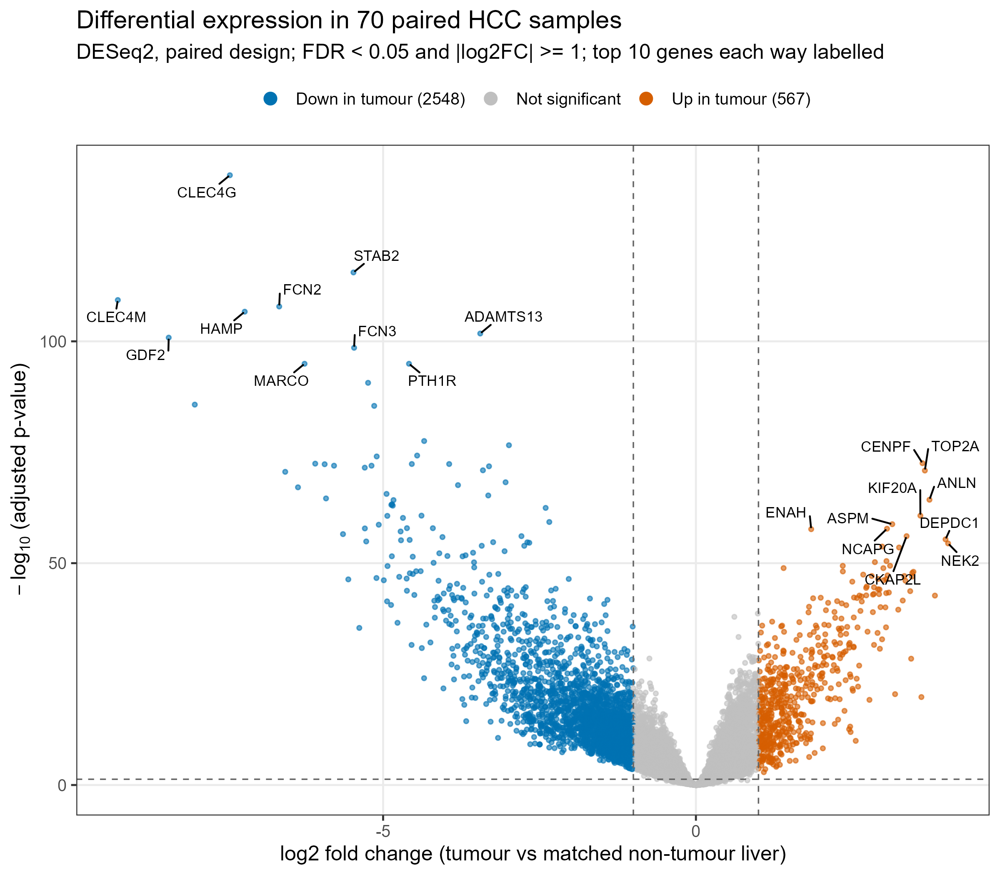
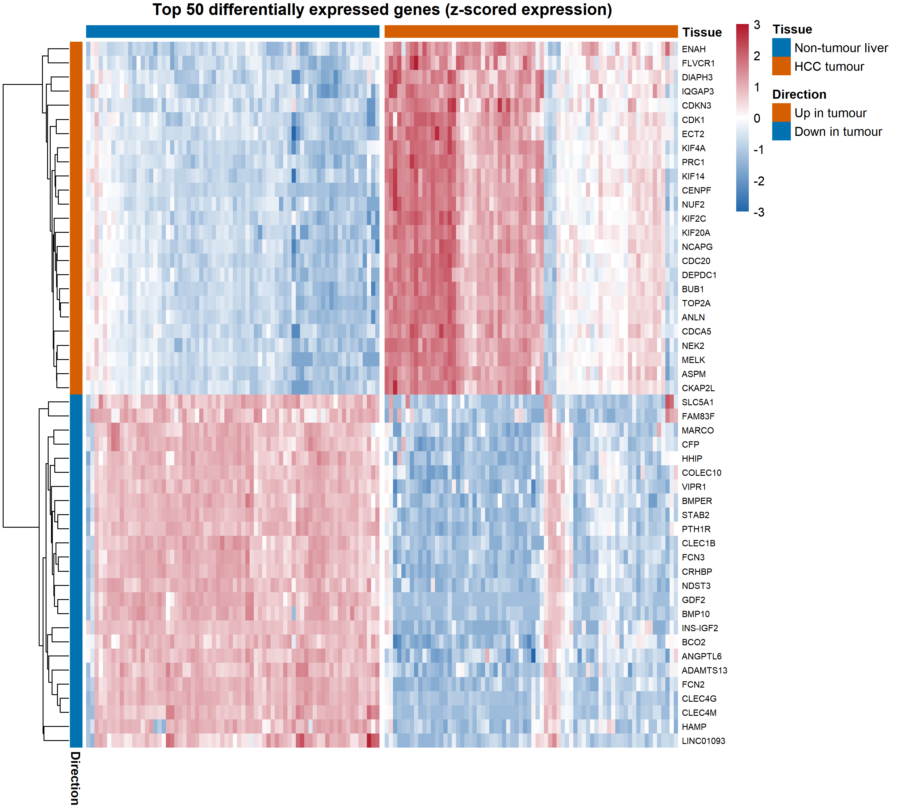
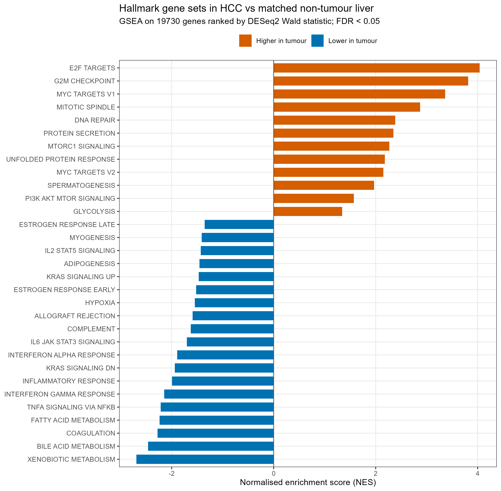
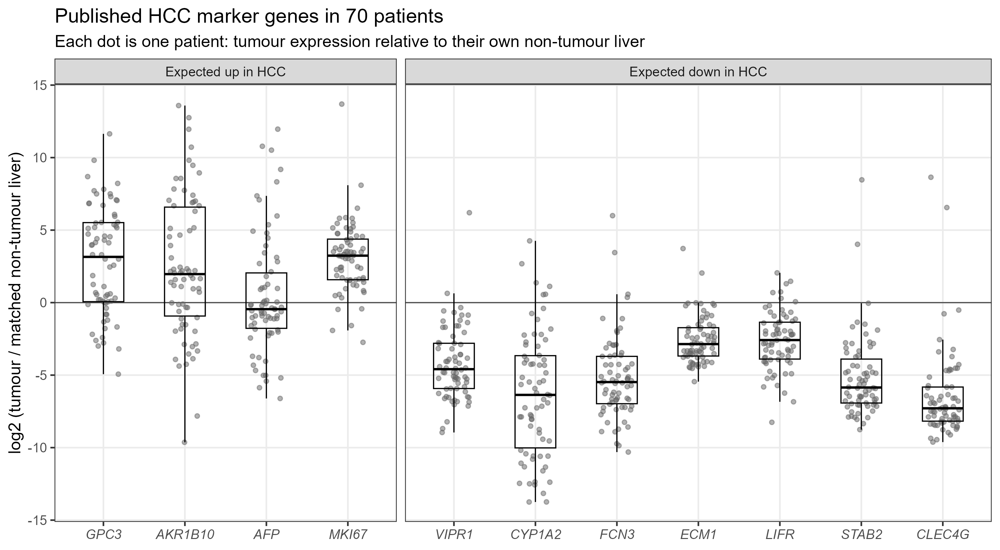

# Transcriptomic Analysis of Hepatitis-Associated Hepatocellular Carcinoma

Paired RNA-seq analysis of **70 hepatocellular carcinomas (HCC) and matched non-tumour liver** (GEO: [GSE144269](https://www.ncbi.nlm.nih.gov/geo/query/acc.cgi?acc=GSE144269)), using R and DESeq2.

## Why this matters

Liver cancer is one of the clearest links between chronic infection and cancer. Nigeria ranks third in the world for viral hepatitis prevalence (WHO, 2025). This dataset comes from Mongolia, which has the world's highest HCC incidence and where more than 90% of cases are driven by hepatitis B or C (Candia et al., 2020).

## Key results

| | |
|---|---|
| Samples | 140 (70 tumours, each with the same patient's non-tumour liver) |
| Genes tested | 19,793 (of 49,579, after filtering low-count genes) |
| Differentially expressed | **3,115** (FDR < 0.05, at least two-fold): 567 up, 2,548 down |
| Strongest up in tumour | CENPF, TOP2A, ANLN, KIF20A, ASPM |
| Strongest down in tumour | CLEC4G, STAB2, CLEC4M, FCN2, HAMP |
| Published HCC markers reproduced | **10 of 11** |
| Robustness to low-quality samples | r = 0.999 |

**1. Tumours switch on cell division.** The top up-regulated genes are mitotic machinery, and gene set enrichment ranks E2F targets (NES 4.04), G2M checkpoint (3.81) and MYC targets (3.36) highest. GO: nuclear division, FDR 9 × 10⁻³⁵.

**2. Tumours lose specialised liver functions.** The most reduced pathways are xenobiotic metabolism (NES −2.69), bile acid metabolism (−2.46), coagulation (−2.28) and fatty acid metabolism, with cytochrome P450 drug metabolism and complement/coagulation cascades in KEGG.

**3. Tumours lose the liver's specialised vascular lining.** Markers of liver sinusoidal endothelial cells are among the most strongly reduced genes (CLEC4G about 175-fold, plus STAB2 and FCN3), consistent with the replacement of normal sinusoids by ordinary capillaries in HCC.

**4. Immune and interferon activity is lower in tumours than in the surrounding liver.** Most patients have chronic viral hepatitis, so the comparison liver is inflamed; this signal reflects that background as much as the tumour.

## Validation against published biology

Eleven marker genes were chosen from the literature **before** inspecting these results, with their expected direction. Each patient's tumour was compared with their own non-tumour liver.

| Gene | Expected | log2 fold change | Patients in expected direction |
|---|---|---|---|
| GPC3 | Up | 2.77 | 77% |
| AKR1B10 | Up | 1.90 | 66% (published: 68.8%) |
| AFP | Up | −0.09 (n.s.) | 40% |
| MKI67 | Up | 3.00 | 93% |
| VIPR1 | Down | −4.34 | 97% |
| CYP1A2 | Down | −6.36 | 91% |
| FCN3 | Down | −5.46 | 94% |
| ECM1 | Down | −2.66 | 97% |
| LIFR | Down | −2.56 | 90% |
| STAB2 | Down | −5.47 | 97% |
| CLEC4G | Down | −7.45 | 97% |

AFP is the one exception, and an instructive one: it is not raised on average, but a subset of patients show 30- to 4,000-fold increases, consistent with AFP being elevated in only a subset of HCCs.

## Sensitivity analysis

A pre-specified rule removed every patient with any library below 5 million reads (4 patients; 66 pairs remained). Results were essentially unchanged: fold changes correlated at **r = 0.999**, **97.2%** of significant genes remained significant, **100%** kept the same direction, and all top-50 genes were reproduced. The main analysis therefore retains all 70 pairs.

## A note on KEGG disease pathways

"Systemic lupus erythematosus" and "Alcoholism" appear among up-regulated KEGG pathways. They are driven almost entirely by histone genes (42 of 42, 42 of 43 and 42 of 43 contributing genes for lupus, alcoholism and neutrophil extracellular trap formation), which dividing cells express highly. They reflect proliferation, not lupus or alcohol.

## Methods

1. **Data.** RSEM gene counts (STAR alignment, GENCODE v21, hg38) and sample metadata from GEO GSE144269.
2. **Quality control.** Five automated integrity checks (sample matching, patient pairing, tumour/normal labels); genes kept with ≥10 reads in ≥70 samples; variance-stabilised data for PCA and sample-distance clustering.
3. **Differential expression.** DESeq2 with a paired design (`~ patient + tissue`), Wald test, Benjamini–Hochberg FDR, apeglm fold-change shrinkage. Significance: FDR < 0.05 and |log2FC| ≥ 1.
4. **Validation.** Eleven pre-specified literature markers; per-patient paired log2 ratios.
5. **Sensitivity.** Refit after excluding patients with a library below 5 million reads.
6. **Enrichment.** clusterProfiler over-representation (GO Biological Process, simplified; KEGG) using all tested genes as background; GSEA of MSigDB Hallmark gene sets on genes ranked by the Wald statistic.
Software: R 4.6.1, DESeq2 1.52.0, apeglm 1.34.0, clusterProfiler 4.20.0, msigdbr 26.1.1 (full list in results/session_info.txt).

## Limitations

- **One cohort, one cause.** Mongolian HCC is mostly viral (hepatitis B, C and D). Results may differ for HCC driven by aflatoxin, alcohol or fatty liver disease, and should be confirmed in an independent cohort (e.g. TCGA-LIHC).
- **The comparison tissue is not healthy liver.** Non-tumour samples come from chronically infected, often inflamed livers.
- **Bulk tissue.** Changes in cell-type mix (fewer sinusoidal, Kupffer and immune cells in tumours) cannot be separated from changes inside cells without deconvolution or single-cell data. Tumour content varies between samples.
- **Processed counts.** The authors' counts were used without re-alignment; the 2014 annotation leaves about 17% of gene IDs unmapped for enrichment.
- **No clinical covariates.** Viral status, stage and survival were not available in the public metadata, so they could not be modelled.
- **Association, not causation.** Expression changes do not establish function; no protein or experimental validation was performed.

## Reproduce

1. Install R (4.6 used) and the packages listed in `results/session_info.txt`.
2. From the [GEO page](https://www.ncbi.nlm.nih.gov/geo/query/acc.cgi?acc=GSE144269), download `GSE144269_RSEM_GeneCounts.txt.gz` and `GSE144269_series_matrix.txt.gz` into `data/raw/`.
3. Run the scripts in order:

| Script | What it does | Time |
|---|---|---|
| `01_download_explore.R` | Load and inspect the data | 1 min |
| `02_build_qc.R` | Pairing, integrity checks, filtering, PCA | 2–3 min |
| `03_differential_expression.R` | DESeq2 paired analysis, volcano and MA plots | 30–60 min |
| `04_validation.R` | Top-50 heatmap, literature markers | 1 min |
| `04b_sensitivity.R` | Refit without low-depth patients | about 30 min |
| `05_enrichment.R` | GO, KEGG, Hallmark GSEA | 5–15 min |
| `06_session_info.R` | Record package versions | seconds |

## References

- Candia J, et al. The genomic landscape of Mongolian hepatocellular carcinoma. *Nat Commun.* 2020;11:4383.
- Love MI, Huber W, Anders S. Moderated estimation of fold change and dispersion for RNA-seq data with DESeq2. *Genome Biol.* 2014;15:550.
- Zhu A, Ibrahim JG, Love MI. Heavy-tailed prior distributions for sequence count data. *Bioinformatics.* 2018.
- Wu T, et al. clusterProfiler 4.0. *The Innovation.* 2021.
- Liberzon A, et al. The Molecular Signatures Database Hallmark gene set collection. *Cell Syst.* 2015.
- Marker sources: Haruyama & Kataoka, *World J Gastroenterol* 2016 (GPC3); *Sci Rep* 2016 (AKR1B10); Ogholbake & Cheng, arXiv 2025 (VIPR1, CYP1A2, FCN3, ECM1, LIFR); Verhulst et al., *Front Med* 2021 (STAB2, CLEC4G).

## Author

**Kareem Damilare Oreoluwa**, Biochemistry, University of Lagos
[GitHub](https://github.com/damilare-kareem)
[LinkedIn](https://www.linkedin.com/in/damilare-kareem0)
